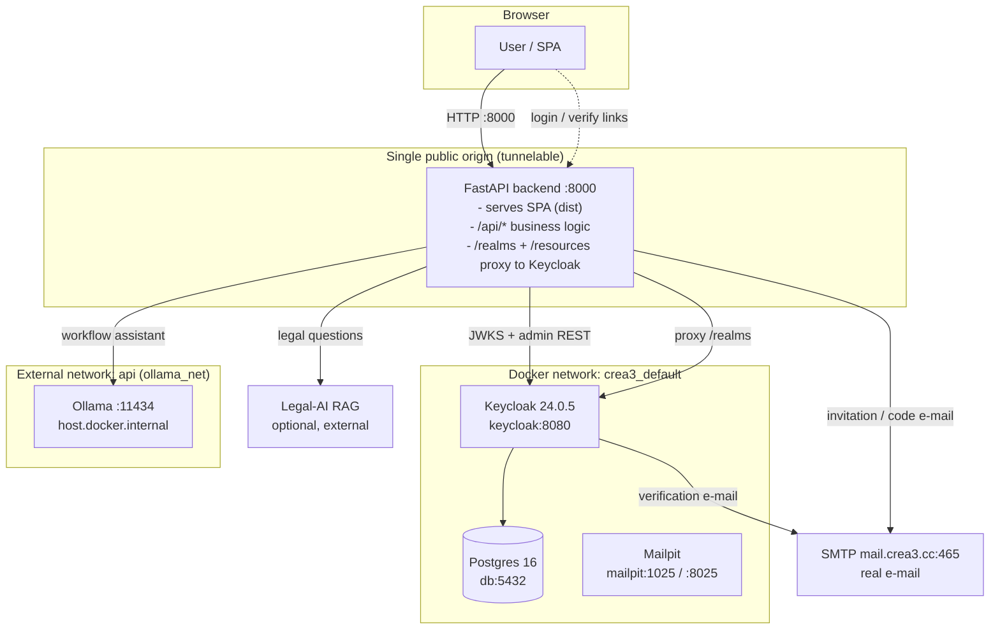
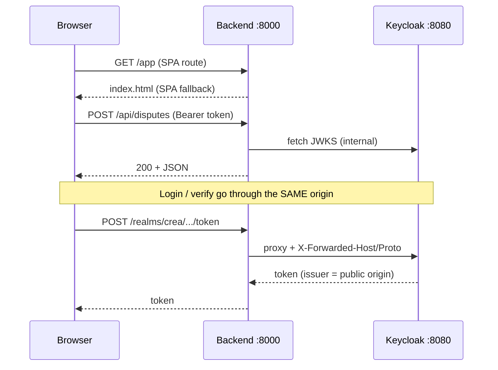
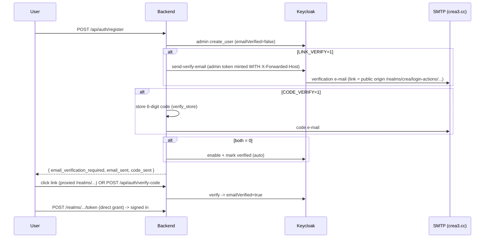
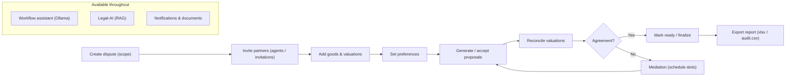

# CREA3

**Collaborative dispute-resolution & fair-division platform** — a FastAPI backend, a React/MUI single-page app, and Keycloak for authentication, packaged so the **entire stack (UI + API + auth) is reachable on ONE origin**. That single origin can be tunnelled to any domain with no CORS or per-domain configuration.

> This README is the operations reference: it documents every exposed route, IP/port, environment parameter, credential, and the end-to-end workflow. It reflects the single-origin revamp (SPA + API + Keycloak proxy behind one port).

---

## Table of Contents

1. [Architecture at a glance](#1-architecture-at-a-glance)
2. [Ports & network exposure](#2-ports--network-exposure)
3. [Services, internal addresses & credentials](#3-services-internal-addresses--credentials)
4. [Environment parameters](#4-environment-parameters)
5. [HTTP routes — reachable from outside](#5-http-routes--reachable-from-outside)
6. [Backend API routes (full)](#6-backend-api-routes-full)
7. [Frontend (SPA) routes](#7-frontend-spa-routes)
8. [Request-routing flow](#8-request-routing-flow)
9. [Registration & email-verification flow](#9-registration--email-verification-flow)
10. [Dispute lifecycle workflow](#10-dispute-lifecycle-workflow)
11. [Running the stack](#11-running-the-stack)
12. [Security notes](#12-security-notes)

---

## 1. Architecture at a glance

The platform runs in **two possible topologies**. Both put everything behind a single public origin.



**Key idea:** the browser never talks to Keycloak's port directly. It hits `<origin>/realms/...`; the backend reverse-proxies that to `keycloak:8080`, forwarding `X-Forwarded-Host/Proto` so Keycloak mints token issuers and verification links for whatever origin the browser used (localhost **or** a tunnel domain).

---

## 2. Ports & network exposure

### Single-port mode — `./run_be.sh` (recommended, tunnelable)

| Port | Bind | Container | Purpose | Exposed outside host? |
|------|------|-----------|---------|-----------------------|
| **8000** | `0.0.0.0:8000` | `crea3-backend` | **The whole app** — SPA + `/api` + Keycloak proxy | ✅ **Yes — tunnel this one port** |
| 8082 | `0.0.0.0:8082` → `:8080` | `crea3-keycloak-1` | Keycloak (direct admin console) | ⚠️ Dev only — not needed publicly |
| 1025 | `0.0.0.0:1025` | `crea3-mailpit-1` | Mailpit SMTP sink (dev) | ⚠️ Dev only |
| 8025 | `0.0.0.0:8025` | `crea3-mailpit-1` | Mailpit web inbox (dev) | ⚠️ Dev only |
| 5432 | *internal only* | `crea3-db-1` | Postgres (Keycloak DB) | ❌ Not published |
| 11434 | host | Ollama (host) | Workflow assistant LLM | ❌ Host-local |

### Full docker-compose mode — `docker compose up`

| Port | Container | Purpose | Notes |
|------|-----------|---------|-------|
| **3010** (`FRONTEND_PORT`) → `:80` | `frontend` (nginx) | SPA + proxies `/api`→backend, `/realms`+`/resources`→keycloak | **Tunnel this** in compose mode |
| 8002 (`BACKEND_PORT`) → `:8000` | `backend` | FastAPI (behind the nginx proxy) | |
| 8080 (`KEYCLOAK_PORT`) → `:8080` | `keycloak` | Keycloak | |
| 1025 / 8025 | `mailpit` | SMTP sink / inbox | |
| *internal* 5432 | `db` | Postgres | Not published |

> **Bottom line:** expose **one** port publicly — `:8000` (run_be.sh) or `:3010` (compose). Everything else is internal/dev.

### Docker networks

| Network | Type | Members |
|---------|------|---------|
| `crea3_default` | compose default (bridge) | backend, keycloak, db, mailpit, frontend |
| `api` (aliased `ollama_net`) | **external** | backend ↔ Ollama server |

---

## 3. Services, internal addresses & credentials

| Service | Image | Internal address | External URL |
|---------|-------|------------------|--------------|
| Backend | `crea3-backend` (FastAPI) | `crea3-backend:8000` / `backend:8000` | `http://localhost:8000` |
| Keycloak | `quay.io/keycloak/keycloak:24.0.5` | `keycloak:8080` | `http://localhost:8082` |
| Postgres | `postgres:16-alpine` | `db:5432` | — (not published) |
| Mailpit | `axllent/mailpit:latest` | `mailpit:1025` (SMTP), `mailpit:8025` (UI) | `http://localhost:8025` |
| Ollama | host process | `host.docker.internal:11434` | — |

### Credentials (⚠️ development defaults — **rotate for production**)

| System | Field | Value |
|--------|-------|-------|
| **Keycloak master admin** | user / pass | `admin` / `admin` |
| Keycloak realm | name | `crea` |
| Keycloak client (frontend) | id | `crea-frontend` — *public*, direct-grant enabled |
| Keycloak client (backend svc) | id / secret | `crea-backend` / `crea-backend-dev-secret-change-me` — *confidential* |
| **App admin authorization** | — | Keycloak **realm role `admin`** on the user (roles: `admin`, `mediator`, `agent`) |
| **Postgres** (Keycloak DB) | db / user / pass | `keycloak` / `keycloak` / `keycloak` |
| **SMTP** (real mail) | host:port | `mail.crea3.cc:465` (SSL) |
| SMTP | user / pass | `info@crea3.cc` / `9818@Crea` |
| SMTP | from | `CREA3 <info@crea3.cc>` |

---

## 4. Environment parameters

### Root `.env` (compose infra: db / keycloak / keycloak-init / mailpit)

| Variable | Default | Purpose |
|----------|---------|---------|
| `KEYCLOAK_PORT` | `8082` | Host port for Keycloak |
| `KEYCLOAK_ADMIN` / `KEYCLOAK_ADMIN_PASSWORD` | `admin` / `admin` | Keycloak master bootstrap admin |
| `KEYCLOAK_REALM` | `crea` | Realm name |
| `KC_DB_DATABASE` / `KC_DB_USER` / `KC_DB_PASSWORD` | `keycloak` | Postgres for Keycloak |
| `APP_PUBLIC_URL` | `http://localhost:3010` | Public origin (compose mode) used for issuers/links |
| `KEYCLOAK_CLIENT_ID` | `crea-frontend` | Public SPA client |
| `KEYCLOAK_ADMIN_CLIENT_ID` / `_SECRET` | `crea-backend` / `crea-backend-dev-secret-change-me` | Backend service account |
| `SMTP_HOST` / `SMTP_PORT` | `mail.crea3.cc` / `465` | Outgoing mail |
| `SMTP_FROM` / `SMTP_FROM_NAME` | `info@crea3.cc` / `CREA3` | From header |
| `SMTP_USER` / `SMTP_PASS` | `info@crea3.cc` / `9818@Crea` | SMTP auth |
| `SMTP_STARTTLS` / `SMTP_SSL` | `false` / `true` | 465 = implicit SSL |

### Backend `.env` (FastAPI)

| Variable | Default | Purpose |
|----------|---------|---------|
| `DATABASE_URL` | `sqlite:///./crea3.db` | App DB (SQLite on a volume) |
| `CORS_ORIGINS` | `*` (compose) / `http://localhost:5173` | Allowed origins (Bearer API, no cookies) |
| `KEYCLOAK_URL` | `http://localhost:8082` | **Public** issuer origin browsers use |
| `KEYCLOAK_INTERNAL_URL` | `http://keycloak:8080` | Server-to-server (JWKS + admin REST + proxy target) |
| `KEYCLOAK_REALM` | `crea` | Realm |
| `KEYCLOAK_CLIENT_ID` | `crea-frontend` | Public client |
| `KEYCLOAK_ADMIN_CLIENT_ID` / `_SECRET` | `crea-backend` / … | Service account for admin REST |
| `KEYCLOAK_CLIENT_SECRET` | *(empty)* | Only if the frontend client is confidential |
| `KEYCLOAK_REQUIRE_VERIFIED_EMAIL` | `true` | Block sign-in until verified |
| `LINK_VERIFY` | `1` | Send Keycloak verification **link** |
| `CODE_VERIFY` | `0` | Send a 6-digit **code** (`/api/auth/verify-code`) |
| *(both `0`)* | — | No verification — account auto-verified |
| `EMAIL_VERIFICATION_TTL_MINUTES` | `1440` | Local verify-token lifetime |
| `FRONTEND_DIST_DIR` | *(set by run_be.sh)* | Serve the SPA build → single origin |
| `OLLAMA_BASE_URL` | `http://localhost:11434` | Workflow-assistant LLM |
| `OLLAMA_MODEL` | `llama3.2:3b` | Model (swap: `qwen2.5:3b`, `phi3:mini`, `gemma2:2b`) |
| `OLLAMA_TIMEOUT_SECONDS` | `60` | LLM timeout |
| `LEGAL_AI_URL` | *(empty)* | External RAG `/chat` endpoint (empty ⇒ disabled) |
| `LEGAL_AI_TIMEOUT_SECONDS` | `30` | RAG timeout |
| `SMTP_*` | see root `.env` | Backend-sent mail (invitations, codes) |
| `SUPPORT_EMAIL` | *(empty)* | Delivery inbox for the in-app support form |
| `PUBLIC_INVITE_LINK` / `PUBLIC_REGISTER_LINK` | `…/app`, `…/register` | Links embedded in emails |

### Frontend `.env` (Vite — build-time)

| Variable | Value | Purpose |
|----------|-------|---------|
| `VITE_API_BASE` | *(empty)* | Relative `/api` on the same origin |
| `VITE_KEYCLOAK_URL` | *(empty ⇒ `window.location.origin`)* | Keycloak reached via the app origin |
| `VITE_KEYCLOAK_REALM` | `crea` | Realm |
| `VITE_KEYCLOAK_CLIENT_ID` | `crea-frontend` | Public client |
| `VITE_KEYCLOAK_ACCOUNT_URL` | `…/realms/crea/account` | Account console |
| `VITE_PROJECT_CONTACT_*` | — | Footer contact info |
| `VITE_PROXY_TARGET` (dev) | `http://crea3-backend:8000` | Vite dev-server `/api` proxy |

---

## 5. HTTP routes — reachable from outside

Everything below is served on the **single origin** (`:8000` single-port, or `:3010` compose):

| Path prefix | Handled by | Public? |
|-------------|-----------|---------|
| `/` and any SPA path (`/app`, `/login`, `/register`, …) | SPA fallback (`index.html`) | ✅ |
| `/assets/*` | Static SPA assets | ✅ |
| `/api/*` | FastAPI business logic (see §6) | ✅ (most require Bearer token) |
| `/realms/*` | **Reverse-proxied to Keycloak** (login, token, verify, certs) | ✅ |
| `/resources/*` | Reverse-proxied to Keycloak (login-page assets) | ✅ |
| `/health` | Liveness `{ "ok": true }` | ✅ |
| `/docs`, `/redoc`, `/openapi.json` | FastAPI interactive API docs | ✅ |

---

## 6. Backend API routes (full)

All under `/api`. **Auth** column: 🔓 public · 🔑 Bearer token · 👑 admin realm role · 👥 dispute participant.

### Authentication — `/api/auth`
| Method | Path | Auth | Purpose |
|--------|------|------|---------|
| POST | `/api/auth/register` | 🔓 | Create account (Keycloak) + trigger verification |
| POST | `/api/auth/verify-code` | 🔓 | Verify with 6-digit code |
| POST | `/api/auth/resend-verification` | 🔓 | Re-send verification email |
| POST | `/api/auth/forgot-password` | 🔓 | Email a reset link |
| POST | `/api/auth/reset-password` | 🔓 | Set new password from signed token |

### Users — `/api/users`
| Method | Path | Auth | Purpose |
|--------|------|------|---------|
| GET | `/api/users/me` | 🔑 | Current user profile |
| PATCH | `/api/users/me` | 🔑 | Update user |
| PATCH | `/api/users/me/profile` | 🔑 | Update profile fields |
| POST | `/api/users/me/password` | 🔑 | Change password |
| POST | `/api/users/me/claimed-share` | 🔑 | Record claimed share |
| DELETE | `/api/users/me` | 🔑 | Delete account |
| DELETE | `/api/users/me/data` | 🔑 | Erase user data (GDPR) |
| GET | `/api/users/mediators` | 🔑 | List available mediators |

### Disputes — `/api/disputes`
| Method | Path | Auth | Purpose |
|--------|------|------|---------|
| GET | `/api/disputes` | 🔑 | List my disputes |
| POST | `/api/disputes` | 🔑 | Create a dispute |
| GET | `/api/disputes/{id}` | 👥 | Dispute detail |
| DELETE | `/api/disputes/{id}` | 👥 | Delete dispute |
| PATCH | `/api/disputes/{id}/status` | 👥 | Change status |
| POST | `/api/disputes/{id}/respond` | 👥 | Respond to invitation |
| POST | `/api/disputes/{id}/abandon` | 👥 | Abandon |
| POST | `/api/disputes/{id}/archive` | 👥 | Archive |

### Per-dispute sub-resources — `/api/disputes/{id}/…`
| Router | Key routes | Purpose |
|--------|-----------|---------|
| `…/agents` | GET, POST, PATCH/DELETE `/{agent_id}`, POST `/{agent_id}/resend-invite` | Manage parties |
| `…/goods` | GET, POST, PATCH/DELETE `/{good_id}`, POST `/{good_id}/valuation` | Assets to divide + valuations |
| `…/preferences` | GET, POST | Party preferences |
| `…/proposals` | POST, POST `/{proposal_id}/accept`, POST `/proposal` | Division proposals |
| `…/reconciliation` | GET, POST `/value`, `/finalize`, `/my-valuations` | Reconcile valuations |
| `…/strategy` | GET, POST | Strategy notes |
| `…/mediation` | GET `/slots`, POST `/slots`, `/slots/{id}/agree`, `/slots/{id}/decline`, `/summary` | Schedule mediation |
| `…/ready` | POST `/finish` | Mark ready / finish |
| `…/report` | GET `/summary`, `/xlsx`, `/audit.csv`, `/lock-status` | Export outcome |
| `…/documents` | GET, POST, GET `/{doc_id}/download`, DELETE | Attachments |
| `…/` (mediator-tools) | POST `/nudge`, `/omitted`, `/mediator-notes`, PATCH `/deadline` | Mediator actions |

### Platform services
| Method | Path | Auth | Purpose |
|--------|------|------|---------|
| POST | `/api/assistant` | 🔑 | Workflow assistant (Ollama) |
| POST | `/api/assistant/public` | 🔓 | Public assistant (help widget) |
| POST | `/api/assistant/disputes/{id}` | 👥 | Dispute-scoped assistant |
| GET | `/api/assistant/models` | 🔑 | Available LLM models |
| POST | `/api/chat` | 🔑 | Legal-AI RAG proxy |
| GET | `/api/metrics/*` | 🔑 | Usage metrics |
| GET/POST | `/api/notifications` (+ read / unread-count / read-all) | 🔑 | Notifications |
| GET/POST | `/api/invitations` | 🔑 | Invitations |
| POST | `/api/support` | 🔑 | Contact-support form |
| GET | `/api/admin/access-logs` | 👑 | Access audit logs |

---

## 7. Frontend (SPA) routes

| Path | Access | Page |
|------|--------|------|
| `/` | public | Landing |
| `/register` | public | Register |
| `/login` | public | Login (embedded direct-grant) |
| `/verify-email` | public | Email verification |
| `/forgot-password`, `/reset-password` | public | Password reset |
| `/scope`, `/partners`, `/help`, `/workflow` | public | Informational (PublicShell) |
| `/admin`, `/admin/dashboard` | admin | Admin login + dashboard |
| `/app` | authed | Dashboard (protected shell) |
| `/app/disputes/:id` | authed | Dispute workspace |
| `/app/legal-ai` | authed | Legal-AI assistant |
| `/app/{notifications,archive,mediators,account,settings}` | authed | User areas |
| `/app/{scope,partners,strategy,ready,mediation,faq,others,support}` | authed | Workflow stages |

---

## 8. Request-routing flow



---

## 9. Registration & email-verification flow



> **Fix baked in:** the admin `send-verify-email` token is minted with the same `X-Forwarded-Host` as the request, so the verification link points at the **public origin** (`localhost:8000` / tunnel domain), never `keycloak:8080`.

---

## 10. Dispute lifecycle workflow



**Roles:** `agent` (party) · `mediator` (neutral facilitator, extra tools) · `admin` (platform-wide, access logs).

---

## 11. Running the stack

### Single-port (recommended — one tunnelable origin)
```bash
./run_be.sh            # builds SPA + backend image, serves everything on :8000
# -> http://localhost:8000     (SPA + API + Keycloak proxy)
```
Optional HMR dev server (`:5173`, proxies `/api` → backend):
```bash
./run_fe.sh
```

### Full docker-compose
```bash
docker compose up -d --build
# App:            http://localhost:3010
# Keycloak admin: http://localhost:8082/admin   (admin / admin)
# Mail inbox:     http://localhost:8025
```

### Expose via one Cloudflare tunnel
Point the tunnel at the single origin (`:8000` or `:3010`). Ensure it forwards `X-Forwarded-Proto: https` (Cloudflare does). No per-domain config needed — issuers and verification links follow the incoming host automatically.

---

## 12. Security notes

- **All values in §3/§4 are development defaults.** Before any real deployment: rotate the Keycloak master password, the `crea-backend` client secret, Postgres credentials, and SMTP credentials; move secrets out of committed `.env` files.
- The API is **Bearer-token only (no cookies)**, so `CORS_ORIGINS=*` is a safe convenience; tighten it if you prefer.
- Only expose **one** port publicly. Keycloak (`:8082`), Mailpit (`:1025/:8025`), and Postgres should stay on the internal network.
- `admin` authorization is by **Keycloak realm role**, not a static password — grant the `admin` role deliberately.
- Mailpit is a **dev mail sink**; production uses the real `mail.crea3.cc` SMTP configured in `.env`.
